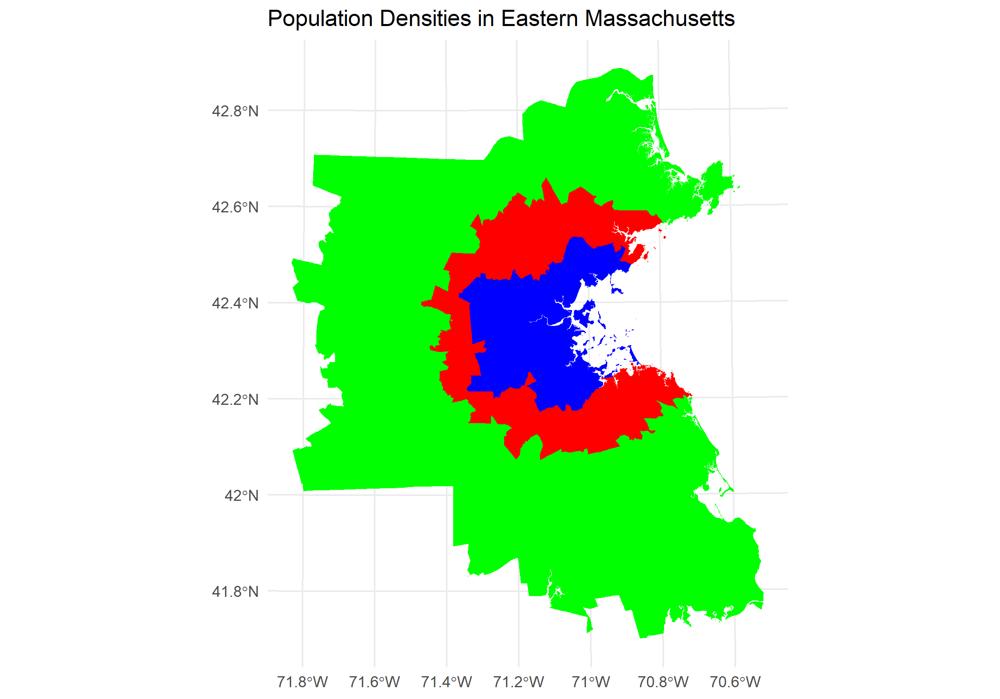

# easternMA-density

What if the entire population of Eastern Massachusetts could fit in a smaller area, with a density equivalent to the area within the Interstate-95?

```{r}
library(tidyverse)
library(sf)

innerbos <- read_sf("ct_housingdat_innerboston/ct_housingdat_innerboston.shp")
gtbos <- read_sf("ct_housingdat_greaterbos/ct_housingdat_greaterbos.shp")

innerbos_acres <- sum(innerbos$AREA_ACRES)
innerbos_pop <- sum(innerbos$POP100_RE)
innerbos_tot_hu <- sum(innerbos$hu)
innerbos_hu_dens <- innerbos_tot_hu/innerbos_acres
innerbos_pop_dens <- innerbos_pop/innerbos_acres

gtbos_acres <- sum(gtbos$AREA_ACRES)
gtbos_pop <- sum(gtbos$POP100_RE)
gtbos_tot_hu <- sum(gtbos$hu)
gtbos_hu_dens <- gtbos_tot_hu/gtbos_acres
gtbos_pop_dens <- gtbos_pop/gtbos_acres
```


If the population of greater boston were to be as densely populated as inner Boston, it would fit in this area:


```{r}
innerdens_gtpop_area <- gtbos_pop/innerbos_pop_dens
innerdens_gtpop_area
```


Get centroids of all CT:

GEOID10 of downtown Boston: 25025030300

```{r}
dtbos <- gtbos %>% filter(GEOID10 == "25025030300")
dtbos_centroids <- st_centroid(dtbos)
gtbos_centroids <- st_centroid(gtbos)
gtbos$dist_to_dtbos <- st_distance(dtbos_centroids, gtbos_centroids, by_element = TRUE)
gtbos <- gtbos %>% arrange(dist_to_dtbos)
```

Calculating cumulative area for now re-ordered census tracts:

```{r}
gtbos$cumsum_area <- cumsum(gtbos$AREA_ACRES)
```


Finding the closest census tracts to downtown boston who's cumulative area equals 540075.8

```{r}
densegtbos <- gtbos %>% filter(cumsum_area <= innerdens_gtpop_area)
```


```{r}
ggplot()+geom_sf(data = gtbos, 
                 aes(geometry = geometry),
                 fill = "green",
                 color = NA)+
  geom_sf(data = densegtbos,
          aes(geometry = geometry),
          fill = "red",
          color = NA)+
  geom_sf(data = innerbos,
          aes(geometry = geometry),
          fill = "blue",
          color = NA)+
  theme_minimal()+
  ggtitle("Population Densities in Eastern Massachusetts")#+ggsave("pop_dens_eastMA.png")
```


```{r}
leftover_acres <- sum(gtbos$AREA_ACRES)-sum(densegtbos$AREA_ACRES)
leftover_acres
```
